<div align="center">

# Linux Security Monitoring & Auditing
## From Technical Evidence to Governance Assurance

**GRC102 – Information Security Governance | Week 4 Practical Laboratory**

</div>

---

## Author Details

| Field | Details |
|---|---|
| **Author** | **Kefilwe Matake** |
| **Registration No.** | **C11_26_CGRCE_17575** |
| **Institution** | International Cybersecurity and Digital Forensics Academy (ICDFA) |
| **Course** | GRC102 – Information Security Governance |
| **Module** | Module 4 – Monitoring and Auditing Security Controls |
| **Assessment** | Week 4 Practical Laboratory |
| **Role** | Security Control Assurance Analyst |
| **Assessment Period** | 26 September – 02 October 2026 |

> **Evidence integrity statement:** All screenshots in this report were captured from the authorised lab environment. Failed commands, missing logs and unavailable tools are reported as observed. No successful output, security event, Lynis finding, timestamp or test result has been fabricated.

---

## Table of Contents

1. [Executive Summary](#1-executive-summary)
2. [Scope and Authorisation](#2-scope-and-authorisation)
3. [Methodology](#3-methodology)
4. [Evidence Bundle 1 – auditd Configuration and Events](#4-evidence-bundle-1--auditd-configuration-and-events)
5. [Evidence Bundle 2 – Linux Log Analysis](#5-evidence-bundle-2--linux-log-analysis)
6. [Evidence Bundle 3 – Lynis Security Assessment](#6-evidence-bundle-3--lynis-security-assessment)
7. [Evidence Bundle 4 – Control Monitoring and Governance](#7-evidence-bundle-4--control-monitoring-and-governance)
8. [Governance Escalation Assessment](#8-governance-escalation-assessment)
9. [Evidence Bundle 5 – SIEM and Automation Mapping](#9-evidence-bundle-5--siem-and-automation-mapping)
10. [Evidence Bundle 6 – Final Audit Report](#10-evidence-bundle-6--final-audit-report)
11. [Remediation and Retest Plan](#11-remediation-and-retest-plan)
12. [Conclusion](#12-conclusion)
13. [Appendix A – Evidence Screenshots](#appendix-a--evidence-screenshots)
14. [AI Assistance Declaration](#ai-assistance-declaration)

---

# 1. Executive Summary

This practical assessed whether an authorised Linux workload could provide reliable security evidence for **system auditing, authentication monitoring, privileged-use oversight, system-log review and host hardening assurance**.

The overall assurance conclusion is **RED – Insufficient Evidence**. This does **not** establish that the host was compromised. Rather, the evidence captured during the lab shows that the environment could not reliably demonstrate that several monitoring and assurance controls were operating as intended.

The three most significant observations were:

1. **Linux audit monitoring was not operational.** The environment reported that it was not booted with `systemd` as PID 1, `auditd` was not running, and the audit log expected by `ausearch` and `aureport` was unavailable.
2. **Host log evidence was unavailable through the expected sources.** `journalctl` reported no journal files, while `/var/log/auth.log` and `/var/log/syslog` were not present in the assigned environment.
3. **A Lynis hardening assessment could not be completed.** The captured evidence shows failed execution attempts and `lynis: command not found`; therefore no hardening index, warnings or suggestions are claimed in this report.

From a governance perspective, the primary concern is **loss of assurance visibility**. If a business-critical Linux system cannot produce or retain the expected audit and security telemetry, management cannot readily demonstrate control effectiveness, investigate events, confirm privileged activity, or support audit and incident-response decisions.

---

# 2. Scope and Authorisation

The assessment was limited to the **ICDFA authorised Linux practice environment** provided for this Week 4 laboratory. Activities were restricted to benign commands and evidence-generation steps required by the practical.

### In Scope

- `auditd` installation/status verification.
- Custom audit-rule configuration.
- `auditctl`, `ausearch` and `aureport` evidence collection.
- `journalctl` system and service-log review.
- Authentication and privilege-use log review.
- General system-log review.
- Lynis installation/access and audit execution attempts.
- Governance interpretation, control ownership, remediation and retesting.
- Conceptual SIEM and continuous-monitoring mapping.

### Out of Scope

- Production infrastructure.
- External hosts and accounts.
- Destructive system changes.
- Unauthorised penetration testing.
- Fabricated security events or evidence.

---

# 3. Methodology

The assessment used the following evidence-oriented approach:

1. **Verify the security control or evidence source.**
2. **Attempt the required benign test or query.**
3. **Capture the observed output exactly as produced.**
4. **Determine whether the evidence demonstrates control operation.**
5. **Identify any assurance gap or environmental limitation.**
6. **Assign a likely control owner and risk priority.**
7. **Recommend remediation and define evidence required for retesting and closure.**

A failed command was not treated as “no finding.” Where a control could not be verified, the result was recorded as an **assurance limitation/control gap**.

---

# 4. Evidence Bundle 1 – auditd Configuration and Events

## 4.1 Service Verification

The initial `systemctl status auditd` command returned:

- the environment was **not booted with systemd as init system (PID 1)**; and
- `systemctl` could not connect to the system bus.

A subsequent service-status check showed that **`auditd` was not running**.

The package installation step showed that `auditd` and `audispd-plugins` were already installed at the current package version, but service enable/start commands could not be managed through `systemctl` in the assigned environment.

**Assurance interpretation:** installation of a security package is not equivalent to control effectiveness. For audit monitoring to provide assurance, the daemon must be running, its rules must be active, and audit records must be generated and retained.

## 4.2 Custom Audit Rules

A dedicated `/etc/audit/rules.d/custom.rules` file was created with watches for:

```text
-w /etc/passwd -p rwxa -k passwd_changes
-w /etc/shadow -p rwxa -k shadow_changes

-a always,exit -F arch=b64 -S execve -k program_execution
-a always,exit -F arch=b32 -S execve -k program_execution

-w /var/log/auth.log -p wa -k auth_failures
```

The rules demonstrate the intended audit design for monitoring sensitive account files, program execution and authentication-log changes. However, when the learner attempted to restart `auditd` and list active rules, the environment returned service-management and audit-rule loading errors.

**Assurance conclusion:** the rules were **defined but not demonstrated as active**. This is a control-implementation gap, not evidence of successful monitoring.

## 4.3 Benign Event Generation

The `/etc/passwd` file was opened in `nano` and exited without saving. A benign `ls /tmp` command was also executed. These actions were intended to produce searchable evidence without modifying sensitive account data.

Because the audit subsystem was not operational and `/var/log/audit/audit.log` was unavailable, the resulting activity could not be validated through the required audit queries.

## 4.4 `ausearch` and `aureport`

Queries using the configured keys returned:

```text
Error opening /var/log/audit/audit.log (No such file or directory)
```

The same missing audit-log condition prevented `aureport`, `aureport --failed` and `aureport --login` from producing usable reports.

### Governance Significance

This is a **High-priority assurance issue** because:

- sensitive account-file activity cannot be independently reconstructed from audit records;
- program execution cannot be verified through the intended audit key;
- authentication-audit evidence is unavailable;
- incident investigation and forensic reconstruction would be constrained; and
- management cannot demonstrate that the host-level audit control is operating.

---

# 5. Evidence Bundle 2 – Linux Log Analysis

## 5.1 `journalctl` Review

The following queries were attempted:

```bash
sudo journalctl
sudo journalctl -u ssh
sudo journalctl --since "today"
sudo journalctl -p err
sudo journalctl -f
```

The environment returned **“No journal files were found”** and **“No entries.”**

This result should not be interpreted as evidence that no security events occurred. It demonstrates that the expected systemd journal was not available as an evidence source in the assigned environment.

## 5.2 Authentication and Privilege-Use Evidence

Attempts to review `/var/log/auth.log` returned **No such file or directory**. Consequently, the learner could not validate failed-password activity or `sudo` use through that traditional Ubuntu/Debian log source.

## 5.3 General System Logging

Attempts to read and search `/var/log/syslog` also returned **No such file or directory**. A further `journalctl` check again confirmed that no journal files were available.

## 5.4 Event / Condition Record

| Event / Condition | Evidence Source | Observed Result | Security Significance | Recommended Action |
|---|---|---|---|---|
| System journal unavailable | `journalctl` | No journal files / no entries | Host activity cannot be reviewed through expected journal source | Enable persistent/appropriate host logging or document approved equivalent source |
| Authentication log unavailable | `/var/log/auth.log` | File not present | Failed logins and privilege use cannot be independently reviewed through expected source | Confirm distribution logging design and enable/forward authentication telemetry |
| General syslog unavailable | `/var/log/syslog` | File not present | System errors/warnings unavailable through expected traditional source | Enable appropriate syslog/journal source or central forwarding |
| Audit log unavailable | `/var/log/audit/audit.log` | File not present | `ausearch`/`aureport` unable to provide audit evidence | Restore operational auditd and verify audit-log creation/retention |

---

# 6. Evidence Bundle 3 – Lynis Security Assessment

The lab required a Lynis system audit and, where available, a hardening index and prioritised findings. The screenshots show installation/execution attempts, but the tool could not be successfully run in the assigned environment.

The observed commands returned resource-related shell errors during setup and later:

```text
sudo: lynis: command not found
```

and the source-directory execution path was also unavailable.

Therefore, this report **does not claim a Lynis hardening index, warning, suggestion or successful scan**.

## Evidence-Based Assurance Findings

| Finding | Risk / Control Issue | Likely Owner | Priority | Recommended Remediation |
|---|---|---|---|---|
| Lynis not executable | Host-hardening assurance cannot be produced | Linux / Platform Operations | High | Install or make available an approved Lynis package/source in the authorised environment |
| No hardening baseline produced | Management lacks independent configuration-assessment evidence | Information Security + Platform Operations | High | Run an approved baseline assessment once the tool is available and retain the result |
| No retest possible | Remediation effectiveness cannot be demonstrated | Control Owner + Assurance Function | Moderate | Repeat the assessment after remediation and compare before/after evidence |

The failed assessment is itself useful assurance evidence: it identifies a gap in the **assurance process/tooling**, not proof that the operating system is insecure.

---

# 7. Evidence Bundle 4 – Control Monitoring and Governance

## 7.1 Control-Monitoring Register

| Control / Objective | Evidence | Owner | Status | KPI / Threshold | Risk / Significance | Remediation | Retest / Follow-up |
|---|---|---|---|---|---|---|---|
| Linux audit service available | `systemctl` / service status | Linux Operations | 🔴 Red | Audit service operational on monitored hosts | No active audit evidence can be demonstrated | Run `auditd` using an environment-supported service model | Confirm process active and audit log generated |
| Sensitive-file audit rules active | `custom.rules`, `auditctl -l` attempt | Security Engineering / Linux Ops | 🔴 Red | 100% required rules loaded | Rules exist on disk but were not demonstrated as active | Load approved rules and resolve environment restriction | `auditctl -l` shows expected rules |
| Audit evidence searchable | `ausearch` / `aureport` | Security Operations | 🔴 Red | Audit queries return retained events | Missing audit log prevents assurance and investigation | Restore `/var/log/audit/audit.log` or approved equivalent | Generate benign event and retrieve by key |
| Authentication monitoring available | `auth.log` / equivalent | Linux Operations / SOC | 🔴 Red | Authentication evidence available for review | Failed logins and privilege use not observable through expected source | Configure correct authentication logging/forwarding | Confirm failed benign login or approved test appears in evidence source |
| System logging available | `journalctl`, `syslog` | Linux Operations | 🔴 Red | System security/error telemetry retained | No expected host log source available | Enable persistent journal/syslog or document alternative | Verify new system events can be queried |
| Host hardening assessment | Lynis | Information Security / Linux Ops | 🔴 Red | Baseline assessment completed on schedule | No hardening assessment result available | Install approved tool and execute baseline audit | Retain completed report and findings |
| Privileged activity visibility | `sudo` evidence | SOC / IAM / Linux Ops | 🔴 Red | Privileged activity reviewable | Expected authentication evidence not available | Centralise privileged-use logging | Verify approved `sudo` event appears and is searchable |

> **RAG interpretation:** Red indicates that operating effectiveness could not be demonstrated from the evidence captured during this laboratory.

---

# 8. Governance Escalation Assessment

## 8.1 Highest-Priority Finding

The highest-priority issue is the **combined absence of reliable host audit and system logging evidence**. Multiple evidence sources failed simultaneously: the audit daemon was not operational, the audit log did not exist, the system journal contained no files, and traditional authentication/system logs were absent.

This creates a broader visibility problem than a single failed monitoring rule because it limits incident detection, investigation, control assurance and management reporting.

## 8.2 Remediation Ownership

- **Linux / Platform Operations:** restore service operation, host logging, audit-log creation and approved security tooling.
- **Security Engineering / SOC:** define required telemetry, validate collection and ensure high-value events are detectable.
- **Information Security / GRC:** confirm evidence supports the control objective and track the deficiency to verified closure.
- **CISO / Risk:** receive escalation if monitoring remains unavailable on a production-equivalent or business-critical workload.

## 8.3 Proposed Escalation Triggers

The following are governance recommendations derived from the lab evidence:

- audit/security telemetry unavailable on a business-critical host beyond the approved monitoring interval;
- required audit rules cannot be loaded or verified;
- privileged/authentication evidence is unavailable during an assurance review;
- repeated failure to produce evidence after remediation;
- missing telemetry materially affects incident investigation, compliance or audit obligations.

## 8.4 Closure Evidence

Successful remediation should be supported by evidence showing that:

1. the audit service is operational;
2. required audit rules are actively loaded;
3. `/var/log/audit/audit.log` or an approved equivalent contains events;
4. a benign test event can be retrieved with `ausearch`;
5. `aureport` produces a valid summary;
6. authentication and system events are retained in an approved evidence source; and
7. Lynis or the approved hardening tool completes successfully and produces a retained report.

## 8.5 Retest Approach

Controls should be retested **after remediation**, with a follow-up check during the next assurance cycle. Retesting must use new evidence rather than relying on screenshots from the failed state.

---

# 9. Evidence Bundle 5 – SIEM and Automation Mapping

Host-level evidence becomes more useful when it is centrally collected, correlated and reported. A conceptual enterprise design is shown below.

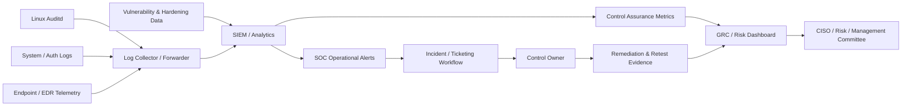

## Operational Alert vs Governance Issue

| Condition | Operational Handling | Governance / Assurance Escalation |
|---|---|---|
| Isolated failed login | SOC investigates against normal baseline | Escalate only if threshold/pattern indicates control weakness or material risk |
| Expected authorised `sudo` event | Record/correlate as routine privileged activity | Escalate if privilege use is unexpected, excessive or not attributable |
| Audit service stops | Platform/SOC operational alert | Escalate if evidence loss exceeds tolerance or affects critical systems |
| Audit log missing | Platform remediation | Governance issue because operating effectiveness cannot be evidenced |
| Persistent log-source failure | Troubleshoot collector/host | Escalate when telemetry completeness falls below approved threshold |
| Hardening assessment overdue/unavailable | Schedule/restore tooling | Escalate if assurance cycle cannot be completed or high-risk systems remain unassessed |

### Automation Opportunities

- Alert when critical log sources stop reporting.
- Monitor audit-rule coverage against a baseline.
- Create tickets automatically when telemetry falls below threshold.
- Track remediation due dates and overdue actions.
- Automate dashboards showing logging coverage and control status.
- Retain human review for risk acceptance, root-cause analysis and final control closure.

---

# 10. Evidence Bundle 6 – Final Audit Report

## 10.1 Consolidated Findings

| ID | Finding | Risk | Accountable Owner | Management Significance |
|---|---|---|---|---|
| **W4-F01** | `auditd` not operating in the assigned environment | High | Linux / Platform Operations | Host audit control cannot be demonstrated |
| **W4-F02** | Custom audit rules defined but not shown as loaded | High | Security Engineering / Linux Ops | Intended monitoring coverage may not be active |
| **W4-F03** | `/var/log/audit/audit.log` unavailable | High | Linux Ops / SOC | Audit queries and forensic reconstruction unavailable |
| **W4-F04** | Journal, authentication and system-log sources unavailable | High | Linux Ops / SOC | Authentication, privilege and system-event assurance is materially limited |
| **W4-F05** | Lynis hardening assessment could not be executed | Moderate–High | Information Security / Linux Ops | Security configuration baseline cannot be independently demonstrated |

## 10.2 Overall Control Posture

**Overall RAG: 🔴 RED – Insufficient Evidence**

The conclusion reflects an **assurance failure**, not a conclusion that compromise occurred. Technical controls may exist in part, but the evidence captured during the exercise was insufficient to demonstrate consistent operating effectiveness.

---

# 11. Remediation and Retest Plan

| Priority | Action | Owner | Closure Evidence |
|---|---|---|---|
| **1** | Restore an operating audit service compatible with the environment | Linux / Platform Operations | Running service/process, created audit log, successful benign audit event |
| **2** | Load and verify the approved custom audit rules | Linux Ops + Security Engineering | `auditctl -l` or approved equivalent showing required rules |
| **3** | Establish reliable system, authentication and privileged-use logging | Linux Ops / SOC | Searchable journal/syslog/authentication evidence or documented equivalent |
| **4** | Forward security telemetry to central monitoring where applicable | SOC / Security Engineering | Collector/SIEM shows current host events and source health |
| **5** | Make the approved host-hardening assessment tool available | Information Security / Linux Ops | Successful Lynis or equivalent baseline report |
| **6** | Independently retest all failed controls | GRC / Assurance | Fresh test evidence and documented closure approval |

A finding should not be closed only because a configuration change was made. Closure requires **evidence that the corrected control now operates as intended**.

---

# 12. Conclusion

This laboratory demonstrates an important governance principle: **security control assurance depends on evidence, not assumption**.

The Linux environment allowed the required control design and commands to be explored, but several expected evidence sources were unavailable. The correct assurance response is therefore not to infer success or fabricate results. The control owner should remediate the telemetry and tooling gaps, after which an independent retest should demonstrate that audit events, authentication activity, system logs and hardening evidence can be reliably collected and reviewed.

At enterprise scale, central SIEM collection, source-health monitoring, automated escalation and governance dashboards would reduce the chance that these evidence gaps remain undetected until an audit or incident occurs.

---

# Appendix A – Evidence Screenshots

The screenshots below are preserved as the technical evidence captured during the authorised exercise.

## Appendix A1 – auditd Configuration and Audit Evidence

### A1.1 Initial `auditd` Status / systemd Limitation

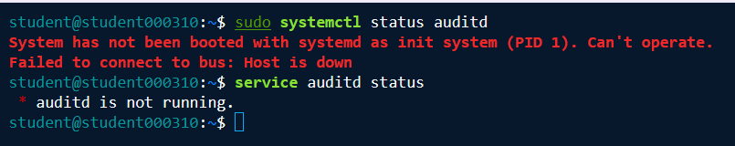

### A1.2 Package Installation and Service Start/Enable Attempt

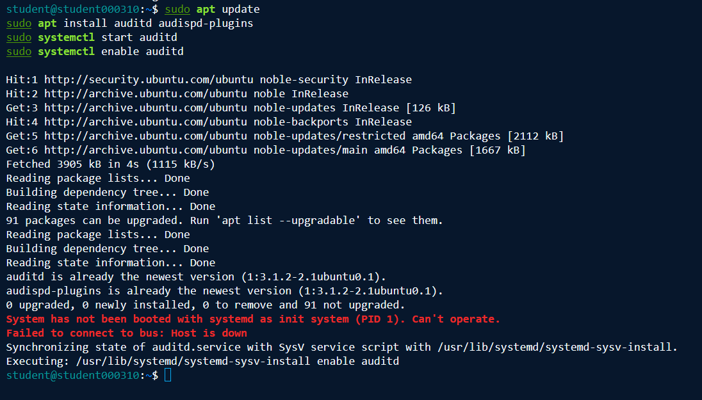

### A1.3 Service Status Recheck

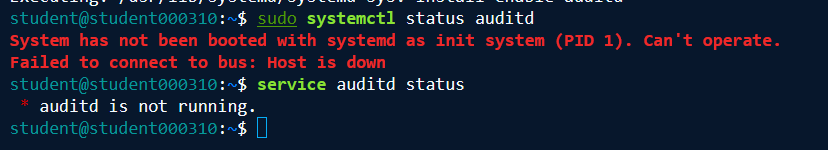

### A1.4 Custom Audit Rules

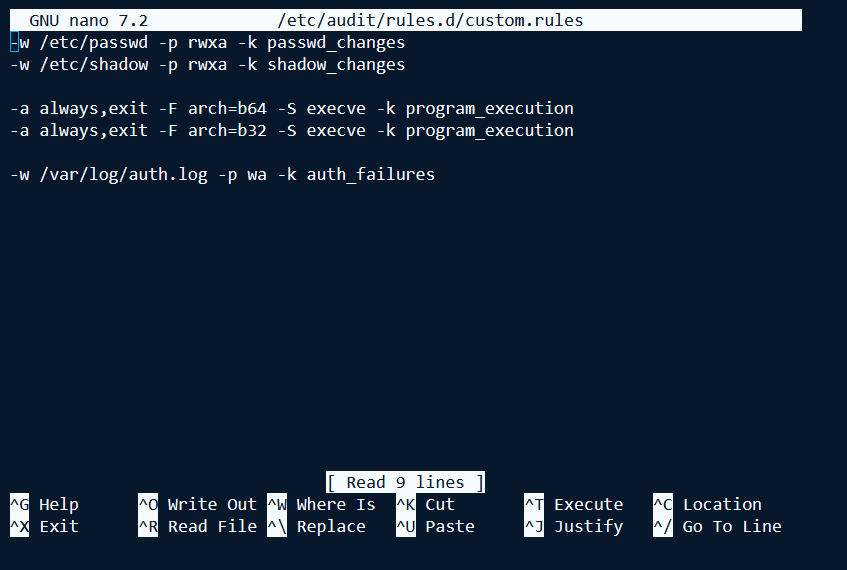

### A1.5 Rule Loading / Restart Attempt

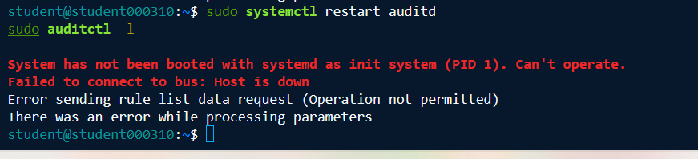

### A1.6 Benign `/etc/passwd` Open

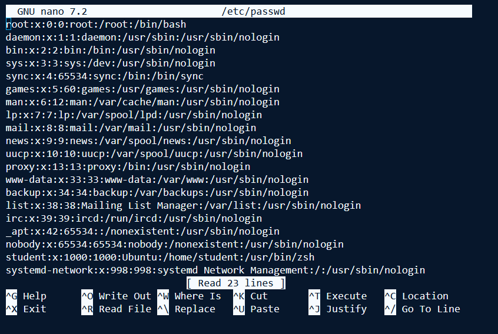

### A1.7 Benign Command Activity

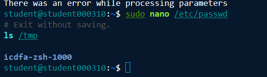

### A1.8 `ausearch` Audit-Log Result

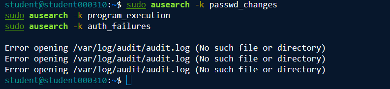

### A1.9 `aureport` Audit-Log Result

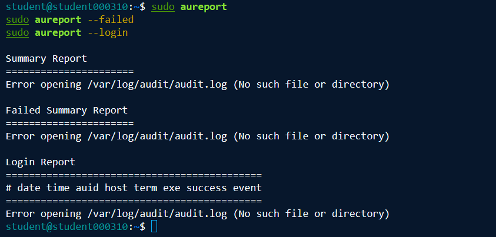

---

## Appendix A2 – Linux Log Analysis Evidence

### A2.1 `journalctl` Review

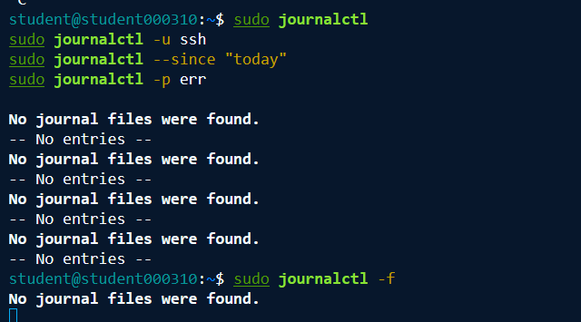

### A2.2 Authentication Log Review

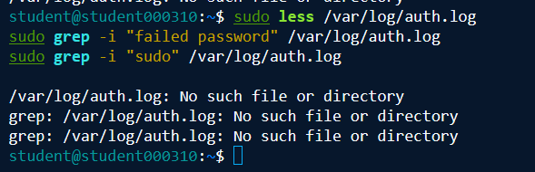

### A2.3 System Log Review

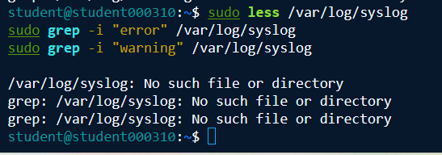

### A2.4 Journal Recheck

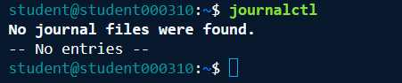

---

## Appendix A3 – Lynis Security Assessment Evidence

### A3.1 Lynis Installation / Access Attempt

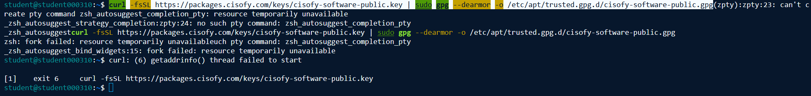

### A3.2 Package-Based Lynis Audit Attempt

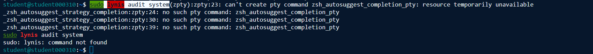

### A3.3 Source-Directory Lynis Audit Attempt

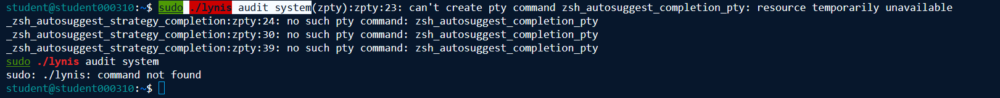

---

# AI Assistance Declaration

AI assistance was used to support **report structure, language refinement, governance interpretation and presentation**. The technical commands and screenshots referenced in this report originate from the learner's authorised laboratory work. The author remains responsible for reviewing the conclusions, understanding the commands and recommendations, and ensuring that the final submission accurately represents the evidence captured.

---

<div align="center">

**Kefilwe Matake**  
C11_26_CGRCE_17575  
GRC102 – Information Security Governance

</div>

