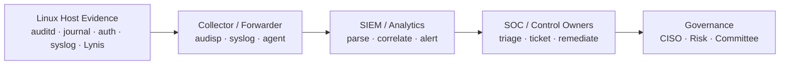
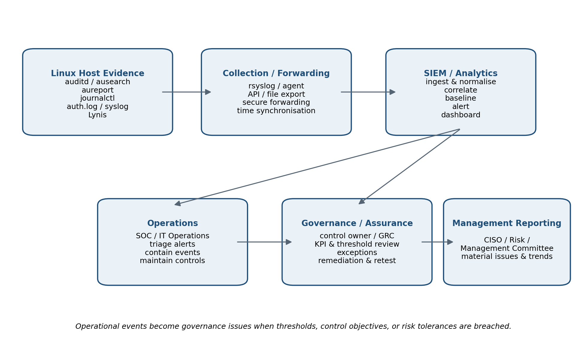

# GRC102 Week 4 Practical Laboratory — Linux Security Monitoring and Auditing

> **From Technical Evidence to Governance Assurance**  
> **Final Control Assurance Report**

| Report Detail | Information |
|---|---|
| **Author** | **Kefilwe Matake** |
| **Registration No.** | **C11_26_CGRCE_17575** |
| **Institution** | International Cybersecurity and Digital Forensics Academy (ICDFA) |
| **Course** | GRC102 – Information Security Governance |
| **Module** | Module 4 – Monitoring and Auditing Security Controls |
| **Role** | Security Control Assurance Analyst |
| **Assessment Period** | 26 September – 02 October 2026 |

> [!IMPORTANT]
> **Evidence authenticity:** This report uses only evidence captured from the authorised lab environment. Missing logs, unavailable services and failed assessment attempts are reported as control-assurance findings; no audit events, Lynis findings, timestamps or successful control results have been fabricated.

**Overall assurance posture:** 🔴 **RED — INSUFFICIENT EVIDENCE**

---

## Table of Contents

- [Executive Summary](#executive-summary)
- [1. Scope and Authorisation](#1-scope-and-authorisation)
- [2. Methodology and Assurance Criteria](#2-methodology-and-assurance-criteria)
- [3. Evidence Bundle 1 — auditd Configuration and Events](#3-evidence-bundle-1--auditd-configuration-and-events)
- [4. Evidence Bundle 2 — Linux Log Analysis](#4-evidence-bundle-2--linux-log-analysis)
- [5. Evidence Bundle 3 — Lynis Security Assessment](#5-evidence-bundle-3--lynis-security-assessment)
- [6. Evidence Bundle 4 — Control Monitoring and Governance](#6-evidence-bundle-4--control-monitoring-and-governance)
- [7. Evidence Bundle 5 — SIEM and Automation Mapping](#7-evidence-bundle-5--siem-and-automation-mapping)
- [8. Evidence Bundle 6 — Final Audit Findings and Management Report](#8-evidence-bundle-6--final-audit-findings-and-management-report)
- [References](#references)
- [AI Assistance Declaration](#ai-assistance-declaration)
- [Appendix A — Supporting Screenshot Evidence](#appendix-a--supporting-screenshot-evidence)

---

## Executive Summary

This report presents the results of the authorised Week 4 Linux security
monitoring and auditing practical. The evidence shows a significant
assurance limitation in the assigned lab environment: security auditing
and host logging could not be demonstrated as operational. The auditd
packages were present, but the audit daemon was not running; systemctl
could not operate because the environment was not booted with systemd as
PID 1; audit rule listing was not permitted; and the expected audit log
was unavailable. In addition, journalctl returned no journal files,
/var/log/auth.log and /var/log/syslog were absent, and Lynis could not
be executed because the command was unavailable in the environment.

These outcomes are reported as evidence rather than hidden or replaced
with invented results. They do not prove that malicious activity
occurred. They do, however, demonstrate that management would be unable
to obtain reliable host-level assurance for authentication, privilege
use, audit trails and hardening status if the same condition existed on
a business-critical production Linux workload. The overall
control-assurance posture observed in this lab is therefore assessed as
RED / INSUFFICIENT EVIDENCE until logging, auditing and baseline
assessment capabilities are restored and independently retested.

> **Evidence integrity statement:** No audit events, Lynis findings, timestamps or successful control results have been fabricated. Where the lab platform prevented a required activity, the failed attempt and resulting assurance limitation are documented as findings.

| **Priority finding**                      | **Rating** | **Management significance**                                                             |
|-------------------------------------------|------------|-----------------------------------------------------------------------------------------|
| Host audit trail unavailable              | High       | Security-relevant activity cannot be reliably recorded, searched or reported.           |
| System/authentication logging unavailable | High       | Authentication, privilege-use and system errors cannot be evidenced or investigated.    |
| Baseline security assessment unavailable  | High       | Hardening status, warnings and remediation priorities cannot be independently measured. |

## 1. Scope and Authorisation

- Assessment was limited to the ICDFA-authorised Linux practice
  environment assigned for training.

- No external systems, production infrastructure, third-party hosts or
  unauthorised accounts were targeted.

- Only benign actions were used to generate evidence, including opening
  /etc/passwd without saving changes and listing /tmp.

- The assessment covered host auditing, audit-rule configuration,
  audit-event querying, Linux log review, authentication/privilege
  evidence, Lynis assessment attempts, and governance mapping.

- The observed platform did not use systemd as PID 1 and did not expose
  the expected audit/journal logging facilities. The precise underlying
  virtualisation/container technology was not established and is
  therefore not assumed.

## 2. Methodology and Assurance Criteria

| **Stage**                    | **Tool / evidence**                       | **Assurance purpose**                                                                       |
|------------------------------|-------------------------------------------|---------------------------------------------------------------------------------------------|
| Audit subsystem verification | systemctl/service, audit package status   | Determine whether the Linux audit service is installed and operating.                       |
| Audit rule configuration     | /etc/audit/rules.d/custom.rules, auditctl | Assess whether sensitive files and program execution are covered by audit rules.            |
| Audit evidence retrieval     | ausearch, aureport                        | Confirm that audit events can be searched and summarised.                                   |
| Log analysis                 | journalctl, auth.log, syslog, grep        | Review authentication, privilege-use, service and error evidence.                           |
| Security assessment          | Lynis                                     | Obtain a host hardening baseline, warnings and remediation suggestions.                     |
| Governance mapping           | Control-monitoring analysis               | Translate technical evidence into status, ownership, thresholds, remediation and retesting. |

The assurance approach distinguishes three control states: **design**
(the control is defined appropriately), **implementation** (the control
is deployed/configured), and **operating effectiveness** (evidence shows
that the control is actually functioning over the relevant period). In
this lab, several controls had evidence of design or partial
implementation but lacked evidence of operating effectiveness.

## 3. Evidence Bundle 1 — auditd Configuration and Events

### 3.1 Service and Package Status

The initial service check returned the message that the system had not
been booted with systemd as the init system (PID 1), so systemctl could
not connect to the service bus. A secondary service check reported that
auditd was not running. Package installation output showed that auditd
and audispd-plugins were already installed, but start/enable attempts
through systemctl were not supported by the assigned environment.

| **Assurance conclusion:** Software presence alone does not demonstrate an operating audit control. The audit daemon was not shown to be active, so the control failed the operating-effectiveness test. |
|---------------------------------------------------------------------------------------------------------------------------------------------------------------------------------------------------------|

### 3.2 Audit Rules

A dedicated /etc/audit/rules.d/custom.rules file was created with
watches for /etc/passwd and /etc/shadow, program-execution rules for
64-bit and 32-bit execve calls, and a watch intended for
authentication-log changes. This demonstrates an appropriate control
design for monitoring sensitive identity files and executable activity.
However, the subsequent attempt to verify loaded rules with auditctl -l
returned an operation-not-permitted error. Therefore, the rules cannot
be claimed as successfully loaded into the kernel audit system.

### 3.3 Audit Event Generation and Retrieval

A benign access to /etc/passwd was performed without saving changes,
followed by a normal /tmp listing. Queries using ausearch for
passwd_changes, program_execution and auth_failures failed because
/var/log/audit/audit.log did not exist. aureport, aureport --failed and
aureport --login produced the same missing-audit-log condition. As a
result, no valid audit event record containing user, action and time
could be produced.

| **Required evidence** | **Observed result**                                                        | **Status**    |
|-----------------------|----------------------------------------------------------------------------|---------------|
| auditd running        | Service reported auditd not running; systemctl unavailable in environment. | Red           |
| Custom audit rules    | Rules file created, but kernel-loaded state could not be verified.         | Red / Partial |
| ausearch result       | Expected audit log unavailable; queries could not return events.           | Red           |
| aureport summary      | Expected audit log unavailable; reports could not be generated.            | Red           |

Governance interpretation: the absence of an audit log must not be
interpreted as the absence of suspicious activity. It is an evidence
gap. On a production workload, such a gap would materially weaken
forensic investigation, privileged-activity oversight and the
organisation’s ability to demonstrate that audit controls are operating.

## 4. Evidence Bundle 2 — Linux Log Analysis

### 4.1 journalctl Review

The required journalctl queries were attempted, including general
journal review, SSH service events, events since today, priority-error
events and live-follow mode. The environment returned “No journal files
were found” and “No entries”. This means the lab evidence did not
provide an operational systemd journal for review.

### 4.2 Authentication, Privilege and System Logs

Attempts to inspect /var/log/auth.log and search for failed-password and
sudo events returned “No such file or directory”. The same condition
occurred for /var/log/syslog and searches for error and warning events.
A further journalctl check also returned no journal files. Therefore,
the required authentication and system events could not be independently
examined in this environment.

| **Event / condition**      | **Evidence source**      | **Time**      | **User / service**    | **Security significance**                            | **Recommended action**                                            |
|----------------------------|--------------------------|---------------|-----------------------|------------------------------------------------------|-------------------------------------------------------------------|
| Audit daemon not operating | service/systemctl output | Not available | auditd                | Host audit trail not operating.                      | Restore audit capability in a supported privileged environment.   |
| No audit event store       | ausearch/aureport        | Not available | Linux Audit           | Audit events cannot be searched or summarised.       | Create/verify audit log and generate a benign test event.         |
| No system journal evidence | journalctl               | Not available | journald / host       | System and service activity cannot be reviewed.      | Enable or identify the supported host logging mechanism.          |
| Authentication log absent  | /var/log/auth.log        | Not available | Authentication / sudo | Failed logins and privilege use cannot be evidenced. | Configure authentication logging or documented equivalent source. |
| System log absent          | /var/log/syslog          | Not available | System services       | Warnings and errors cannot be evidenced.             | Enable syslog/journal equivalent and central forwarding.          |

| **Important interpretation:** Because the relevant log sources were unavailable, the correct conclusion is “not evidenced / not assessable”, not “no security events occurred”. |
|---------------------------------------------------------------------------------------------------------------------------------------------------------------------------------|

## 5. Evidence Bundle 3 — Lynis Security Assessment

The Lynis activity could not be completed successfully in the assigned
environment. Installation/access attempts encountered shell/resource
limitations, and both the package-style command (sudo lynis audit
system) and source-directory command (sudo ./lynis audit system)
returned command-not-found results. Consequently, no genuine Lynis
version, hardening index, warnings, suggestions or report file were
produced.

To preserve evidence authenticity, this report does not invent Lynis
findings. Instead, the failed assessment is treated as an assurance
limitation and the following evidence-backed conditions are recorded:

| **Finding**                           | **Evidence**               | **Risk / control issue**                                                      | **Owner**                     | **Priority** | **Required remediation**                                                      |
|---------------------------------------|----------------------------|-------------------------------------------------------------------------------|-------------------------------|--------------|-------------------------------------------------------------------------------|
| L-01 — Lynis unavailable              | Command-not-found evidence | Approved host baseline assessment could not run.                              | Platform Operations           | High         | Install/restore Lynis using an instructor-approved package or source method.  |
| L-02 — Hardening state not measurable | No scan output or index    | Management lacks evidence of configuration weaknesses and hardening maturity. | Security Assurance            | High         | Complete an authorised system audit and retain the generated report/log.      |
| L-03 — No baseline for retesting      | No initial Lynis report    | Remediation effectiveness cannot be compared against a baseline.              | Security Assurance / Platform | Moderate     | Establish baseline, remediate prioritised findings and repeat the assessment. |

Optional hardening was not performed because no validated Lynis
recommendation was generated. Making a configuration change solely to
improve an assumed score would not meet the lab’s evidence-quality
requirement.

## 6. Evidence Bundle 4 — Control Monitoring and Governance

| **ID** | **Control / objective**               | **Objective**                                           | **Owner**                       | **Evidence**                                    | **Status**            | **KPI/KRI**                                                      | **Escalation trigger**                                                  | **Risk**                                 | **Remediation**                                            | **Retest / follow-up**                                         |
|--------|---------------------------------------|---------------------------------------------------------|---------------------------------|-------------------------------------------------|-----------------------|------------------------------------------------------------------|-------------------------------------------------------------------------|------------------------------------------|------------------------------------------------------------|----------------------------------------------------------------|
| CM-01  | Host audit daemon                     | Record security-relevant host activity.                 | Platform Operations             | Service/package screenshots                     | Red                   | 100% of critical hosts with audit service active                 | Any critical host without audit service beyond approved recovery window | Loss of forensic and assurance trail.    | Use supported init/kernel audit capability; start auditd.  | Service active; auditctl status; benign event recorded.        |
| CM-02  | Audit rules                           | Monitor sensitive files and program execution.          | Security Engineering / Platform | custom.rules + auditctl attempt                 | Red / Partial         | 100% approved critical rules loaded                              | Missing critical watch or rule verification failure                     | Sensitive changes may be invisible.      | Load rules using supported method and verify kernel state. | auditctl -l shows approved rules; test event matches key.      |
| CM-03  | Audit log availability                | Retain searchable audit evidence.                       | Platform Operations / SOC       | ausearch & aureport errors                      | Red                   | Audit log available and searchable on all in-scope hosts         | Audit log missing or no events during expected activity                 | No audit search/report evidence.         | Restore audit event storage and permissions.               | ausearch and aureport return expected test event/report.       |
| CM-04  | System/auth logging                   | Capture host, authentication and privilege evidence.    | Platform Operations / SOC       | journalctl/auth.log/syslog attempts             | Red                   | 100% critical hosts provide security logs                        | No logging source or ingestion gap beyond tolerance                     | Detection/investigation blind spot.      | Enable journal/syslog equivalent and retention.            | Benign sudo/login/service event appears locally and centrally. |
| CM-05  | Authentication & privilege monitoring | Detect failed login and privileged-use anomalies.       | SOC / IAM                       | No auth.log or journal evidence                 | Red                   | Authentication/privilege events searchable within monitoring SLA | Unavailable source or repeated failures above threshold                 | Account misuse may go undetected.        | Restore source and create monitoring/alert rules.          | Generate approved test event; verify alert/search result.      |
| CM-06  | Host hardening assessment             | Measure configuration and hardening weaknesses.         | Security Assurance / Platform   | Lynis command-not-found evidence                | Red                   | 100% scheduled baseline assessments completed                    | Missed assessment or unresolved high-risk finding                       | Hardening posture not demonstrable.      | Install Lynis or approved equivalent; run baseline scan.   | Report generated; findings assigned; remediation retested.     |
| CM-07  | Central SIEM forwarding               | Provide enterprise visibility and evidence correlation. | SOC                             | Not tested; dependent local sources unavailable | Amber / Not evidenced | 100% critical hosts forwarding required logs                     | Collector/source heartbeat absent or ingestion gap                      | Enterprise monitoring may be incomplete. | Implement log forwarding and source-health monitoring.     | SIEM confirms host heartbeat and expected test event.          |

### 6.1 Governance Escalation Responses

**Highest priority finding.** The absence of an operating audit and
host-logging trail is the highest priority because it undermines every
later assurance activity. Without trustworthy logs, the organisation
cannot reliably detect, reconstruct or prove security-relevant activity.
In a production-equivalent business-critical system, this would justify
immediate escalation.

| **Question**                                    | **Governance response**                                                                                                                                                                                       |
|-------------------------------------------------|---------------------------------------------------------------------------------------------------------------------------------------------------------------------------------------------------------------|
| Who owns remediation?                           | Platform/Linux Operations owns service and logging restoration; Security Engineering owns audit policy/rules; SOC validates monitoring and ingestion; Security Assurance performs independent retesting.      |
| When should the CISO/Risk function be notified? | Proposed trigger: any business-critical host has no security/audit logging beyond the approved recovery window, logging repeatedly fails, or a suspected security event occurs while evidence is unavailable. |
| What proves successful remediation?             | Active audit service, verified loaded rules, searchable audit event, functioning system/authentication log source, successful baseline scan, and—where applicable—central SIEM ingestion.                     |
| When should controls be retested?               | Immediately after remediation, again after material configuration change, and thereafter at the organisation’s approved continuous-monitoring frequency.                                                      |

## 7. Evidence Bundle 5 — SIEM and Automation Mapping

Host-level evidence becomes useful for enterprise governance when
collection health, correlation, thresholds and reporting are designed as
an end-to-end control. The architecture below shows how the evidence
sources used in this lab should feed continuous monitoring.

*Figure 1 — Proposed path from Linux host evidence to enterprise monitoring and governance assurance.*

| **Condition**                                       | **Operational handling**                                          | **Governance / assurance escalation**                                                     |
|-----------------------------------------------------|-------------------------------------------------------------------|-------------------------------------------------------------------------------------------|
| Isolated expected failed login or normal sudo event | SOC/IT reviews according to normal alerting rules.                | Escalate only if frequency, user, asset or context breaches the defined threshold.        |
| Audit daemon or log source unavailable              | Platform team restores service and opens incident/control ticket. | Escalate if a critical system remains blind beyond tolerance or the failure is recurrent. |
| Unexpected privileged activity                      | SOC investigates user, command, asset and change context.         | Escalate where unauthorised, high impact, repeated or linked to sensitive data.           |
| Audit-rule drift / missing control coverage         | Security Engineering corrects configuration.                      | Track as a control deficiency; report repeat/systemic drift to CISO/Risk.                 |
| Overdue high-risk hardening issue                   | Owner remediates and provides evidence.                           | Escalate overdue or risk-accepted items according to risk appetite.                       |
| Lynis/baseline assessment not completed             | Assurance owner reschedules and resolves tooling issue.           | Escalate repeated missed assurance cycles or inability to evidence compliance.            |

Automation should support, not replace, professional judgement. Useful
automated controls include log-source heartbeat monitoring, failed-login
correlation, privileged-command alerts, rule/configuration compliance
checks, ticket creation when thresholds are breached, and recurring
evidence dashboards. Human review remains necessary for context,
false-positive validation, risk acceptance and closure approval.

## 8. Evidence Bundle 6 — Final Audit Findings and Management Report

| **ID** | **Finding**                                                                        | **Rating** | **Control owner**               | **Governance implication**                                                     |
|--------|------------------------------------------------------------------------------------|------------|---------------------------------|--------------------------------------------------------------------------------|
| W4-F01 | auditd installed but not operating; expected audit log unavailable.                | High       | Platform Operations             | Management could not rely on host audit evidence.                              |
| W4-F02 | Configured audit rules could not be verified as loaded.                            | High       | Security Engineering / Platform | Control design exists but implementation/operation is unproven.                |
| W4-F03 | journalctl had no journal files; auth.log and syslog were absent.                  | High       | Platform Operations / SOC       | Authentication, privilege and system activity lack reviewable evidence.        |
| W4-F04 | Lynis security assessment could not execute.                                       | High       | Security Assurance / Platform   | No independent host hardening baseline or prioritised findings were available. |
| W4-F05 | Central SIEM forwarding could not be demonstrated from the local evidence sources. | Moderate   | SOC                             | Enterprise visibility and continuous assurance remain unverified.              |

### 8.1 Remediation and Retest Plan

| **Priority** | **Action**                                                                                             | **Accountable owner**         | **Proposed target**                                                   | **Independent retest / closure evidence**                                                             |
|--------------|--------------------------------------------------------------------------------------------------------|-------------------------------|-----------------------------------------------------------------------|-------------------------------------------------------------------------------------------------------|
| 1            | Provide a supported/privileged Linux environment and restore auditd operation and audit-event storage. | Platform Operations           | Immediate / within 24 hours for a production-equivalent critical host | Security Assurance verifies active service, audit status, loaded rules and a searchable benign event. |
| 2            | Restore a supported system/authentication logging source and verify retention and timestamps.          | Platform Operations + SOC     | Within 24–48 hours                                                    | Generate approved authentication/sudo/service events and confirm they are searchable.                 |
| 3            | Install Lynis from an approved source (or approved equivalent) and complete a baseline assessment.     | Security Assurance + Platform | Within 3 business days                                                | Retain version, scan output, hardening summary, findings and report/log location.                     |
| 4            | Forward required Linux security evidence to the SIEM and enable source-health monitoring.              | SOC / Security Engineering    | Within 5 business days                                                | Confirm host heartbeat, test-event ingestion, correlation and alert/ticket generation.                |
| 5            | Track all findings to closure and report overdue High items to CISO/Risk.                              | Control owners + GRC          | Ongoing                                                               | Closure ticket contains original evidence, remediation evidence, independent retest and approval.     |

### 8.2 Management Conclusion

The practical demonstrated a central governance principle: a control
cannot be treated as effective merely because a package is installed, a
configuration file exists or a requirement has been documented.
Management needs reliable, repeatable evidence of operation. In the
assessed environment, audit and logging visibility were insufficient and
the hardening assessment could not be completed. The correct governance
response is therefore to record the limitations, assign accountable
owners, restore the evidence-producing controls, and independently
retest before closure.

Once auditd, system/authentication logging and Lynis or an approved
equivalent are operational, the same evidence should be centralised
through an enterprise SIEM or assurance platform. This would support
continuous monitoring, trend analysis, control-health reporting and
risk-based escalation rather than relying on isolated manual checks.

## References

- International Cybersecurity and Digital Forensics Academy (ICDFA).
  (2026). GRC102 Week 4 Practical Laboratory: Linux Security Monitoring
  and Auditing.

- International Cybersecurity and Digital Forensics Academy (ICDFA).
  (2026). GRC102 Week 4: Monitoring and Auditing Security Controls.

- Dempsey, K. et al. (2011). NIST SP 800-137: Information Security
  Continuous Monitoring (ISCM) for Federal Information Systems and
  Organizations. National Institute of Standards and Technology.

- Linux Audit Project. (2026). auditd(8), auditctl(8), ausearch(8) and
  aureport(8) documentation.

- CISOfy. (2026). Lynis Installation and Usage Guide.

## AI Assistance Declaration

AI tools were used to support report structuring, evidence
interpretation, governance mapping, language refinement and formatting.
All screenshots and command outputs referenced in this report were
supplied from the student’s authorised lab work. No missing audit
events, Lynis findings, timestamps or successful test results were
fabricated. The student remains responsible for understanding, verifying
and explaining the submitted evidence and recommendations.

## Appendix A — Supporting Screenshot Evidence

The screenshots below are reproduced from the student’s authorised Week
4 lab document. They are retained as supporting evidence of both
successful configuration attempts and environmental/control failures.
Screenshots are grouped by the module in which they were captured.

### Appendix A1 — Module 1: auditd and Audit Evidence

> The evidence images below are embedded with repository-relative paths so they render directly in GitHub. They preserve the original screenshots supplied in the Week 4 practical document.

*Appendix A1 Evidence 1 — auditd configuration and audit-evidence capture from the authorised Week 4 lab environment.*

*Appendix A1 Evidence 2 — auditd configuration and audit-evidence capture from the authorised Week 4 lab environment.*

*Appendix A1 Evidence 3 — auditd configuration and audit-evidence capture from the authorised Week 4 lab environment.*

*Appendix A1 Evidence 4 — auditd configuration and audit-evidence capture from the authorised Week 4 lab environment.*

*Appendix A1 Evidence 5 — auditd configuration and audit-evidence capture from the authorised Week 4 lab environment.*

*Appendix A1 Evidence 6 — auditd configuration and audit-evidence capture from the authorised Week 4 lab environment.*

*Appendix A1 Evidence 7 — auditd configuration and audit-evidence capture from the authorised Week 4 lab environment.*

*Appendix A1 Evidence 8 — auditd configuration and audit-evidence capture from the authorised Week 4 lab environment.*

*Appendix A1 Evidence 9 — auditd configuration and audit-evidence capture from the authorised Week 4 lab environment.*

### Appendix A2 — Module 2: Linux Log Analysis

*Appendix A2 Evidence 1 — Linux log-analysis evidence from the authorised Week 4 lab environment.*

*Appendix A2 Evidence 2 — Linux log-analysis evidence from the authorised Week 4 lab environment.*

*Appendix A2 Evidence 3 — Linux log-analysis evidence from the authorised Week 4 lab environment.*

*Appendix A2 Evidence 4 — Linux log-analysis evidence from the authorised Week 4 lab environment.*

### Appendix A3 — Module 3: Lynis Assessment Attempts

*Appendix A3 Evidence 1 — Lynis assessment-attempt evidence from the authorised Week 4 lab environment.*

*Appendix A3 Evidence 2 — Lynis assessment-attempt evidence from the authorised Week 4 lab environment.*

*Appendix A3 Evidence 3 — Lynis assessment-attempt evidence from the authorised Week 4 lab environment.*
